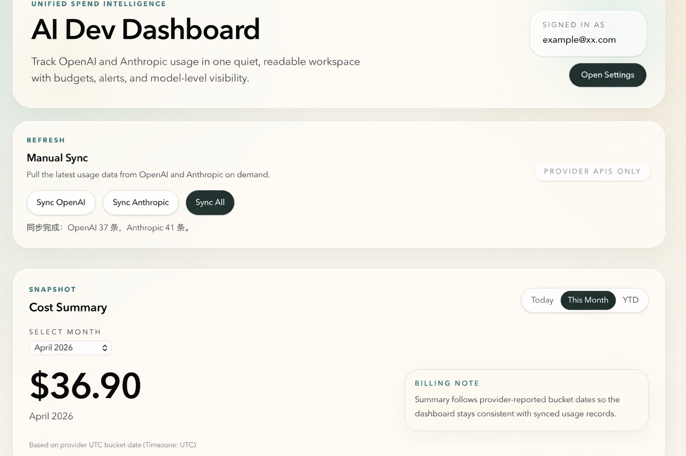
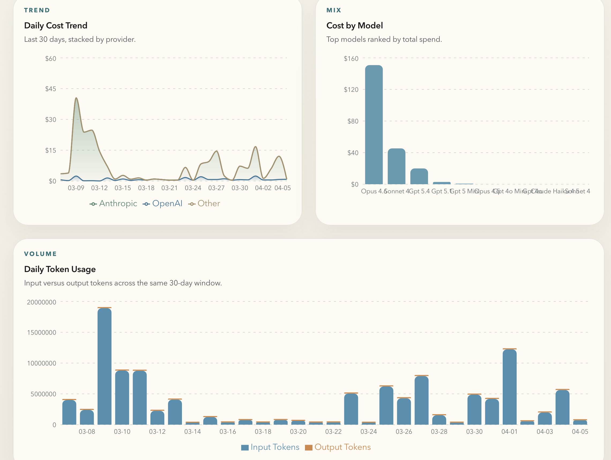
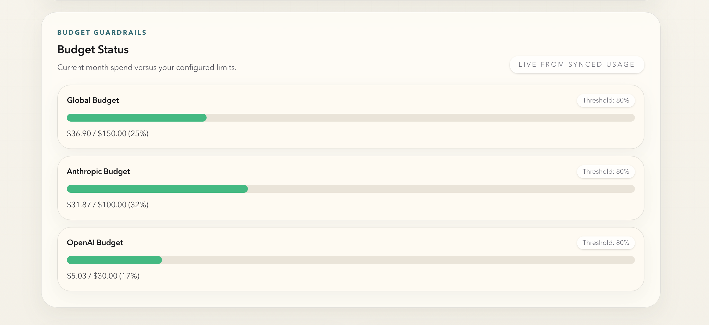

# AI Dev Dashboard

`Tech Stack: Next.js / TypeScript / Supabase / Recharts / Vercel`

A unified API spend monitoring dashboard for AI developers, bringing usage and cost data from providers like OpenAI and Anthropic into one place.








## Project Goal
When you use multiple AI APIs at the same time, you should not need to log into each provider separately to check billing and usage. This dashboard gives you one place for unified visibility, budget management, and basic alerts.

## Problems It Solves
- Pulls fragmented OpenAI and Anthropic spend into one dashboard
- Makes monthly spend and budget drift visible earlier
- Gives a clearer provider-level and model-level view of usage patterns

## Core Features
1. **Multi-provider data aggregation**
   - Connects to OpenAI and Anthropic organization-level usage / cost APIs
   - Pulls, normalizes, and stores usage and cost data in a unified format
2. **Visual dashboard**
   - Cost Summary (Today / This Month / YTD)
   - Daily Cost Trend
   - Cost by Model
   - Daily Token Usage
3. **Budget alerts**
   - Global budget
   - Per-provider budget
   - Progress bars and threshold warnings
4. **API key management**
   - Save and update OpenAI / Anthropic keys
   - Server-side encrypted storage
   - Manual sync actions
5. **User authentication**
   - Supabase Auth sign in / sign up
   - Per-user data isolation
6. **Raw record inspection**
   - Dedicated Records page for recently synced usage rows

## Architecture Highlights

### RLS row isolation
Supabase Row Level Security keeps every user's providers, budgets, and usage records scoped to their own account. The app can rely on the database layer for isolation instead of duplicating access rules throughout the UI.

### AES-256-GCM key encryption
Provider API keys are encrypted before they are written to the database and decrypted only on the server when a sync runs. This keeps sensitive provider credentials out of plaintext storage while staying simple enough for a solo project on Vercel.

### Upsert idempotent sync
Sync routes are designed to be safe to run repeatedly by upserting normalized usage rows instead of blindly inserting duplicates. That keeps manual re-syncing practical when validating provider data or catching up after API delays.

### Model name canonicalization
Provider responses are inconsistent about model names, aggregation rows, and billing labels, so the sync pipeline normalizes those values before storing and charting them. This makes the dashboard totals and model comparisons much more stable across OpenAI and Anthropic.

## Tech Stack
- **Frontend:** Next.js 16 (App Router) + TypeScript + Tailwind CSS 4 + Recharts
- **Backend / Database:** Supabase (PostgreSQL + Auth + Row Level Security)
- **Deployment:** Vercel
- **API sources:** OpenAI Organization Usage / Costs API, Anthropic Usage / Cost Report API

## Current Status

### Completed
1. Next.js + TypeScript + Tailwind project setup
2. Supabase Auth, PostgreSQL, and RLS setup
3. OpenAI usage / cost sync
4. Anthropic usage / cost sync
5. Dashboard charts and summary views
6. Global budget + per-provider budget alerts
7. Settings page for provider keys and budgets
8. AES-256-GCM encrypted API key storage
9. Dedicated Records page
10. Light-theme UI redesign
11. Vercel production deployment

### Roadmap
- Add more advanced records filtering and search
- Support automated scheduled sync
- Expand automated test coverage around provider parsing and sync flows

## Local Development

### 1. Install dependencies
```bash
npm install
```

### 2. Configure environment variables
Create a `.env.local` file in the project root:

```env
NEXT_PUBLIC_SUPABASE_URL=your_supabase_url
NEXT_PUBLIC_SUPABASE_ANON_KEY=your_supabase_anon_key
API_KEY_ENCRYPTION_SECRET=your_random_secret
```

Notes:
- `NEXT_PUBLIC_SUPABASE_URL`: your Supabase project URL
- `NEXT_PUBLIC_SUPABASE_ANON_KEY`: your Supabase anon key
- `API_KEY_ENCRYPTION_SECRET`: the server-side secret used to encrypt provider API keys

Generate a random secret with:

```bash
openssl rand -base64 32
```

### 3. Start the development server
```bash
npm run dev
```

Default local URL:

```bash
http://localhost:3000
```

If port `3000` is already in use, Next.js will automatically switch to another port.

## Database Migrations
Current migration files:

- `supabase/migrations/001_initial.sql`
- `supabase/migrations/002_usage_provider_constraints.sql`
- `supabase/migrations/003_20260303_budget_alerts.sql`

If your local or remote database does not yet include the latest schema changes, apply the corresponding migrations first.

## API Key Requirements
- OpenAI usage / cost sync requires an **Admin API key**
- Anthropic usage / cost sync requires an **organization admin key**
- A normal project key may save successfully, but it will not be able to fetch organization-level reports

## Security Notes
- Provider keys are stored in `providers.api_key_encrypted`
- Keys are encrypted server-side using `AES-256-GCM`
- Historical plaintext keys are not supported; before deploying the encrypted version, old provider records should be cleared and re-entered

## Known Limitations
- `usage_records.date` uses the provider's UTC bucket date, so it may differ by one day from the user's local calendar date
- Anthropic same-day data may appear later than the Anthropic console and may require syncing again later or the next day

## Project Boundaries
- No real-time streaming monitoring
- No API proxy / request forwarding
- No multi-tenant SaaS features
- Built as a personal tool, not optimized for large-scale users
